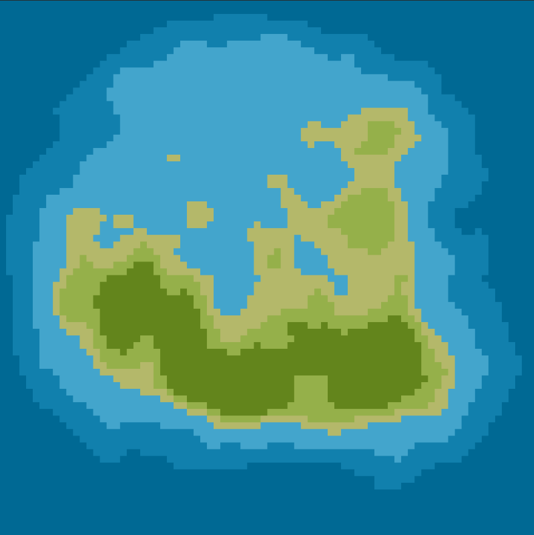
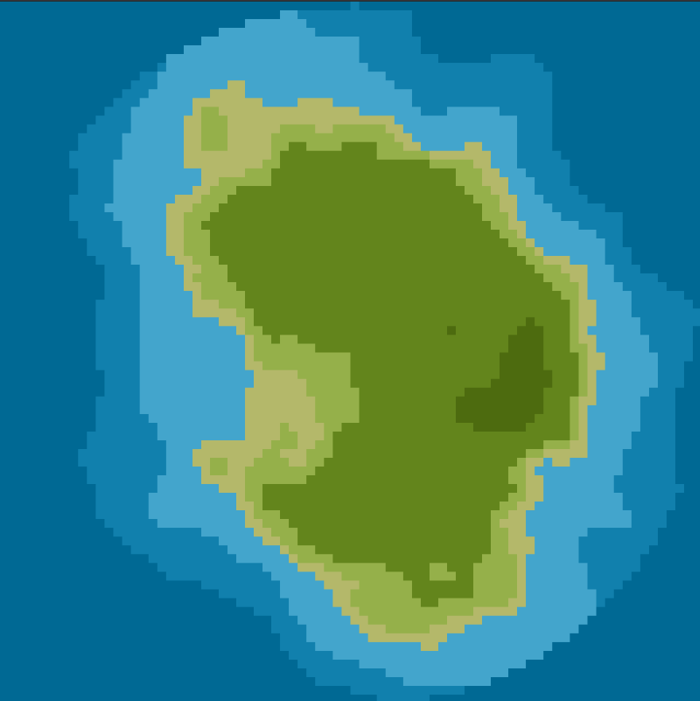
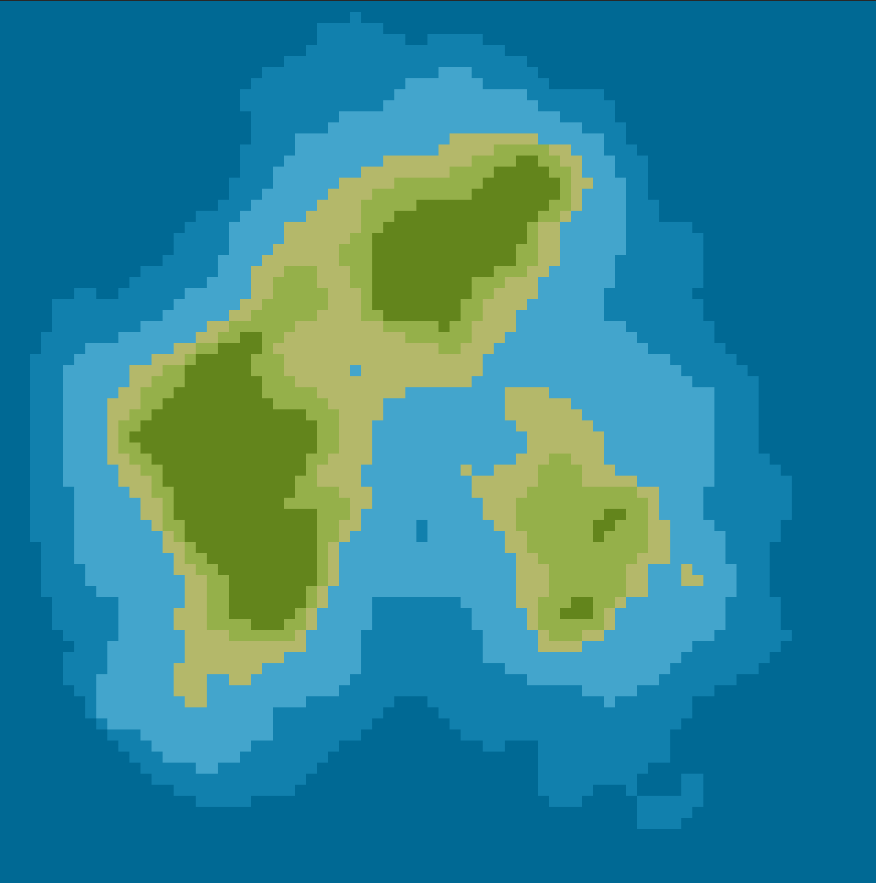

## World Generator
---

Simple world generator script, using perlin noise to generate a hight map. 

With the hight map generated, each range of heights is mapped to a type of "biome". Places with high heights are colored with a darker green to represent mountain like environment, on the other hand low heights are filled with watter.

These height ranges can be ajusted in the tilles.json file, where can add or change existing biomes.

Each biome was three attributes that you can change:
        
        Name : name of the biome
        RGB : color that the tile will display
        maxHeight : the height map is composed by values between [0, 1]
                    this biome will render if the height in that location is between 
                    ]lastBiomeMaxHeight, maxHeight]

### Some Examaples

     
     
     

---

### How to run it

To run the code, you need to host a local server. A easy way to do this is using python http.server library:

    python -m http.server <port>

Now you can connect with your browser to `localhost:<port>`, and see the code running.

---

